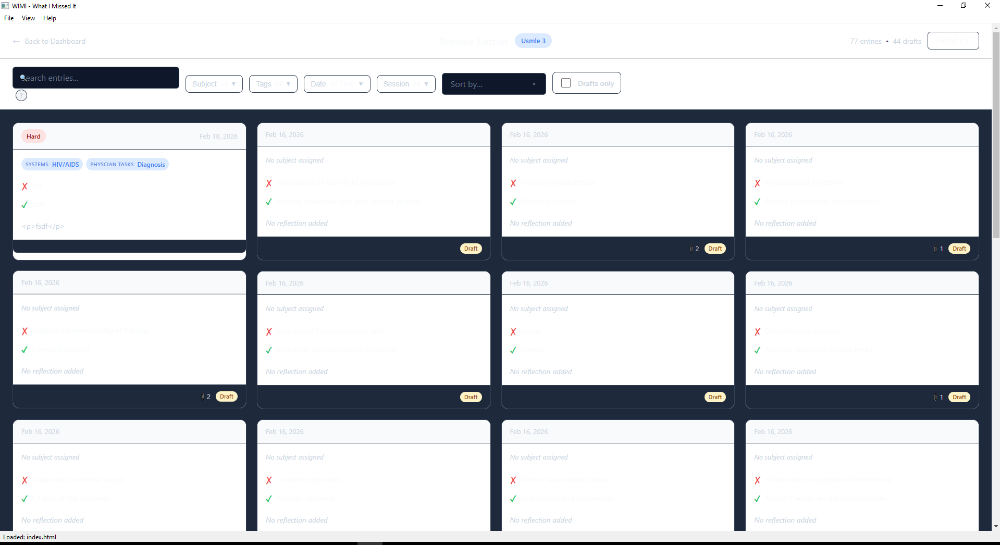
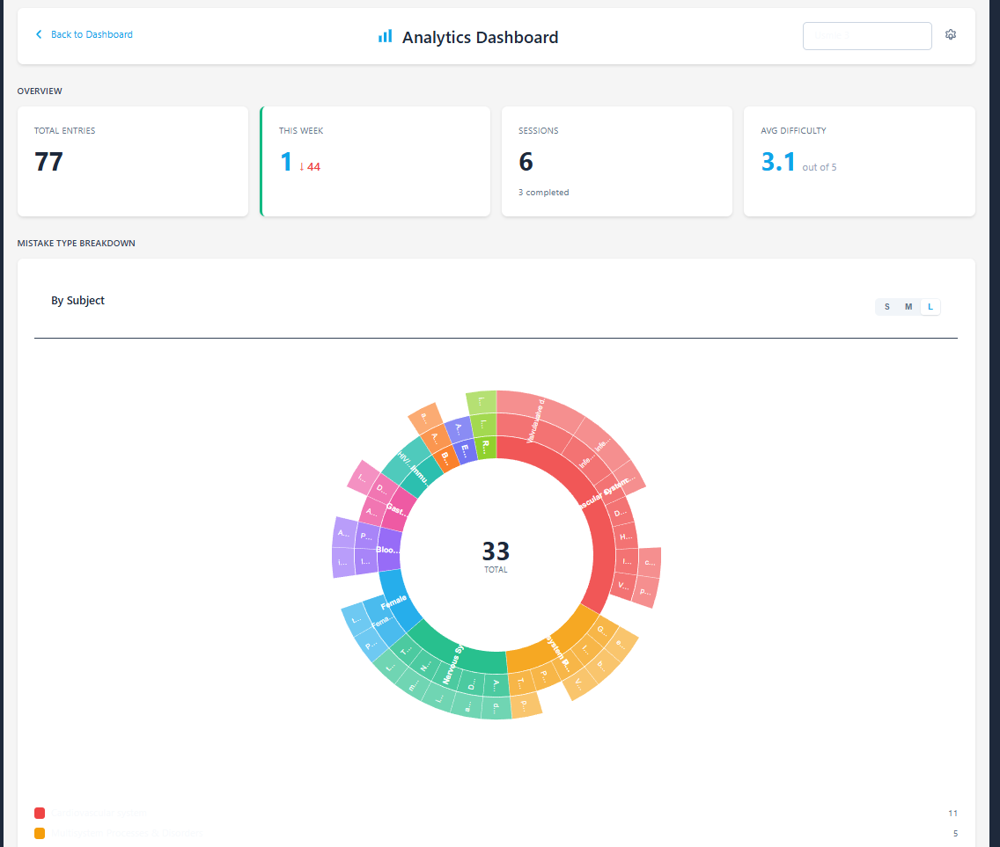

# WIMI — What I Missed It

**A metacognitive exam preparation tool.** WIMI helps students analyze *why* they miss questions — not just track that they missed them. Log every wrong answer with a structured reflection, tag it against your exam's real content outline, and let the analytics show you where your preparation is actually weak.

Built for high-stakes standardized exams (USMLE, NBME shelf exams, MCAT, SAT, GRE, LSAT, CPA and more), but works for any exam you can describe as a subject hierarchy.





## Why

Reviewing a practice test usually stops at "I got 12 wrong." WIMI pushes one step further: for each miss, you record what you picked, what was right, why you got it wrong, and what the mistake reveals (knowledge gap, misread stem, time pressure, second-guessing). Over hundreds of entries, patterns emerge that a raw score never shows — and the dashboard weighs them against how heavily each topic actually counts on your exam.

## Features

- **Structured mistake entry** — session-based workflow with rich text (tables, math via KaTeX), media attachments, fuzzy subject search, and auto-save
- **Multi-dimensional exam models** — categorize a single question along several axes at once (e.g. organ system × physician task × discipline for USMLE-style exams)
- **Real content-outline weighting** — subject hierarchies are true DAGs with per-edge weights, a Hamilton largest-remainder question allocator, feasibility checking, and support for computer-adaptive (variable-length) exams
- **Analytics dashboard** — D3.js sunburst, cross-dimension heatmaps, activity trends, streak tracking, weakness-vs-weight quadrant analysis, and pattern detection with study recommendations
- **10 built-in exam templates** — USMLE Step 1/2 CK, NBME shelf exams, MCAT, SAT, ACT, GRE, LSAT, CPA — fully customizable after selection
- **Assignable notes** — multiple notes per entry, each linkable to specific subjects, aggregated in per-subject deep-dive views
- **Session timer** — multi-round timing with break tracking, plus import of externally-timed sessions
- **Plugin system** — backend (Python) and frontend (JS/CSS) plugins with a permission-scoped API
- **Local-first** — everything lives in SQLite on your machine; no account, no cloud, no telemetry

## Getting started

Requires **Python 3.11+** on Windows or macOS.

```bash
git clone https://github.com/pclahoud/Project-WIMI.git
cd Project-WIMI
pip install -r requirements-prod.txt
python run_wimi.py
```

Development mode gives you F5 reload and F12 dev tools. On first launch WIMI creates a local demo user and walks you through the exam setup wizard.

### Building a standalone executable

```bash
# Windows → dist/WIMI/WIMI.exe
build_windows.bat

# macOS universal binary
chmod +x build_macos.sh && ./build_macos.sh
```

See `docs/BUILD_WINDOWS.md` and `docs/BUILD_MACOS.md` for details.

## Architecture

Three layers, all local:

1. **Backend** — Python + SQLite (WAL mode), composed from domain mixins (`src/database/`), with a versioned migration runner
2. **Bridge** — PyQt6 WebChannel exposing `@pyqtSlot` methods to the frontend (`src/app/`)
3. **Frontend** — HTML/CSS/JS rendered in QWebEngineView, with D3.js visualizations and Fuse.js search (`src/web/`)

The UI test stack (`wimi_test/`) drives the real app over the Chrome DevTools Protocol; regression scenarios run in CI headlessly.

## Testing

```bash
pip install -r requirements-test.txt

# Fast suite (skips end-to-end UI scenarios)
pytest -m "not regression and not slow"

# Everything, including CDP-driven UI regression scenarios
pytest
```

Coverage is enforced at 80% on the database layer.

## Documentation

- `docs/planning/FUTURE_VISION.md` — roadmap and project status
- `docs/PLUGIN_DEVELOPMENT.md` — plugin development guide
- `docs/architecture/` — database schema reference
- `CLAUDE.md` — codebase orientation (architecture, conventions, commands)

## Status

Production-ready for personal use, under active development. See the roadmap for what's next.

## License

[MIT](LICENSE)
