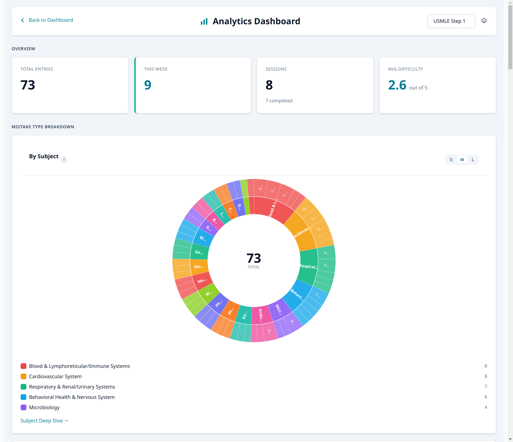
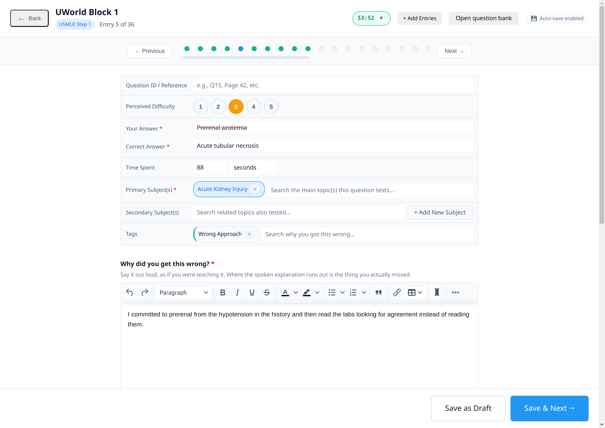
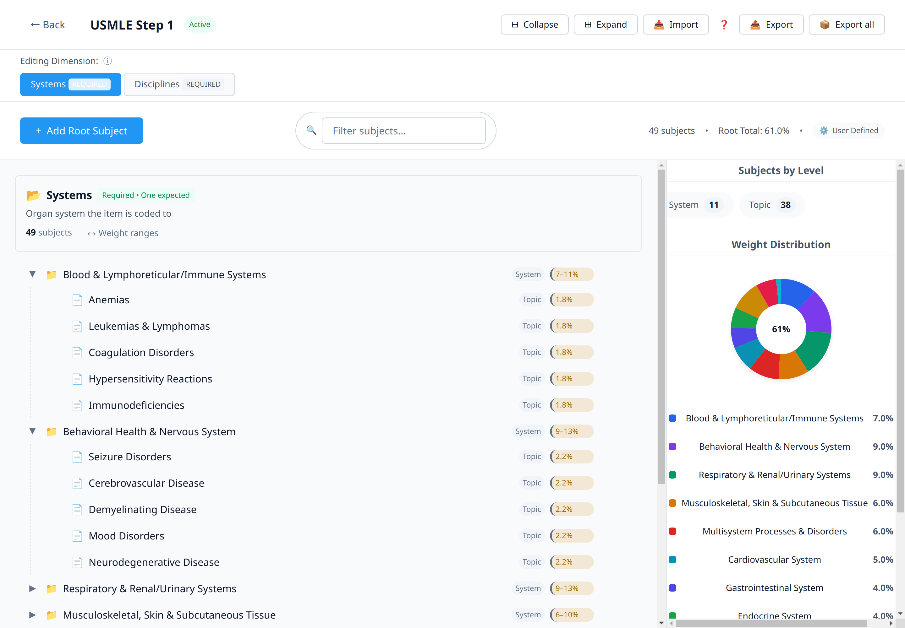
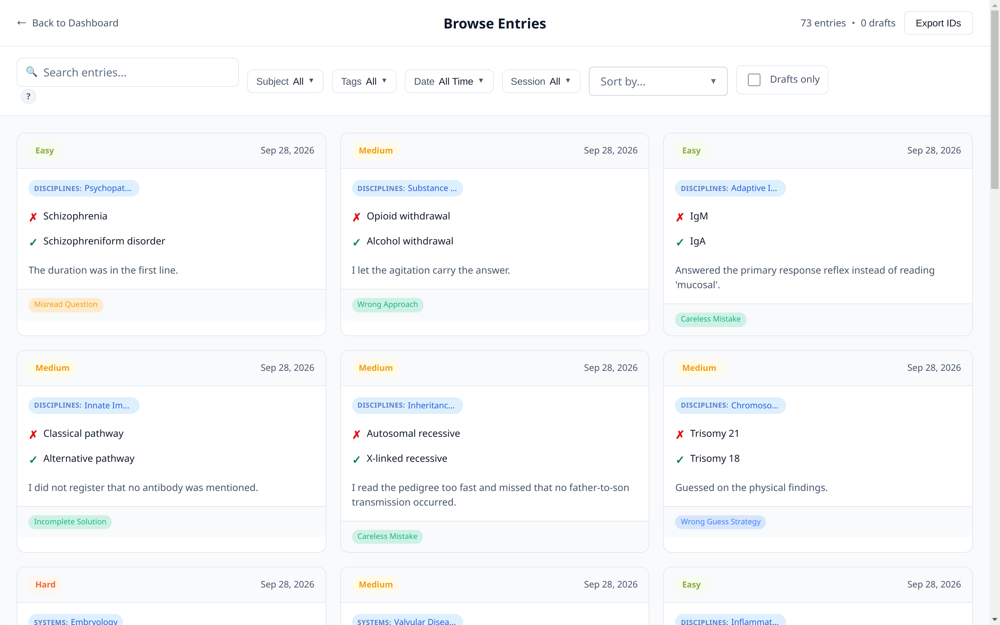

# WIMI, Why I Missed It

A metacognitive exam preparation tool. WIMI records *why* you miss questions rather than only that you missed them. Log every wrong answer with a structured reflection, tag it against your exam's content outline, and the analytics show you which parts of your preparation are weak.

Built for high-stakes standardized exams. USMLE, NBME shelf exams, MCAT, SAT, ACT, GRE, LSAT and CPA ship as templates, and it works for any exam you can describe as a subject hierarchy.



## Why

Reviewing a practice test usually stops at "I got 12 wrong." For each miss, WIMI records what you picked, what was right, why you got it wrong, and what kind of mistake it was. A knowledge gap, a misread stem, time pressure, second-guessing.

Over hundreds of entries those counts separate the topics you never learned from the ones you know and keep losing anyway. The dashboard weighs both against how heavily each topic counts on your exam, so a weak topic worth 2% of the test ranks below a middling one worth 15%.



## Features

- **Structured mistake entry.** A session-based workflow with rich text, tables, math through KaTeX, image attachments, fuzzy subject search and autosave.
- **Multi-dimensional exam models.** Tag one question along several axes at once. USMLE-style exams use organ system, physician task and discipline together.
- **Content-outline weighting.** Subject hierarchies are directed acyclic graphs with a weight on every edge. A Hamilton largest-remainder allocator turns those weights into question counts, it checks whether your targets are feasible, and it handles variable-length adaptive exams.
- **Analytics dashboard.** A D3.js sunburst, cross-dimension heatmaps, activity trends, streak tracking, and a quadrant chart plotting weakness against exam weight. It also flags recurring patterns and suggests what to study.
- **Ten built-in exam templates.** USMLE Step 1 and Step 2 CK, NBME shelf exams, MCAT, SAT, ACT, GRE, LSAT and CPA. Edit any of them after you pick one.
- **Assignable notes.** An entry can carry several notes, each one attached to a specific subject and collected on that subject's deep-dive page.
- **Session timer.** Multi-round timing with breaks, and you can import a session you timed somewhere else.
- **Question bank beside the form.** An embedded browser pane holds your question bank next to the entry form. Logins survive between sessions.
- **Speech-to-text.** Dictate a reflection instead of typing it. Transcription runs on your own machine through [whisper.cpp](https://github.com/ggerganov/whisper.cpp), and the speech model downloads the first time you use it.
- **Related topics.** Link one subject to another with a written reason. The links appear on each subject's deep-dive page.
- **Import, export, archive and restore.** Bring a whole exam outline in from a JSON file behind a preview that tells you what will change, write it back out, and restore subjects or whole dimensions after you archive them.
- **Profiles.** Several study profiles on one machine, each one portable as a single `.wimi` file.
- **Folder sync.** Keep one profile in step across your own computers through a folder in whatever cloud client you already run, tested with Box Drive. WIMI writes files into that folder and never talks to a cloud service itself.
- **Plugin system.** Python plugins on the backend, JavaScript and CSS on the frontend, through an API that asks for permissions.
- **Local-first.** Everything lives in a SQLite file on your machine. No account, no server, no telemetry.



## Getting started

Requires Python 3.11 or later on Windows or macOS.

```bash
git clone https://github.com/pclahoud/Project-WIMI.git
cd Project-WIMI
python -m venv .venv
# Windows: .venv\Scripts\activate    macOS: source .venv/bin/activate
pip install -r requirements-prod.txt
python run_wimi.py
```

Use a virtual environment. The Qt and Chromium versions are pinned exactly, and a mismatch changes how pages render. Development mode gives you F5 reload and F12 dev tools. On first launch WIMI creates a local demo user and walks you through the exam setup wizard.

Speech-to-text needs the whisper.cpp binary, which is not committed. When you run from source, fetch it once with `python scripts/fetch_whisper.py`. The build scripts below do this for you.

### Building a standalone executable

```bash
# Windows, produces dist/WIMI/WIMI.exe
build_windows.bat

# macOS on Apple Silicon, produces dist/WIMI/WIMI.app
chmod +x build_macos.sh && ./build_macos.sh
```

Both scripts first check that the active environment matches `requirements-prod.txt` and refuse to build on a mismatch.



## Architecture

Three layers, all local:

1. **Backend.** Python and SQLite in WAL mode, composed from domain mixins in `src/database/`, with a versioned migration runner.
2. **Bridge.** A PyQt6 WebChannel that exposes `@pyqtSlot` methods to the frontend, in `src/app/`.
3. **Frontend.** HTML, CSS and JavaScript rendered in a QWebEngineView, with D3.js charts and Fuse.js search, in `src/web/`.

The UI test stack in `wimi_test/` drives the real app over the Chrome DevTools Protocol.

## Testing

```bash
pip install -r requirements-test.txt

# Fast suite, skipping the end-to-end UI scenarios
pytest -m "not regression and not slow"

# Everything, including the UI regression scenarios
pytest
```

The UI regression scenarios start the real app, open its window and drive it, so they need a desktop session and take several minutes. pytest enforces 80% coverage on the database layer, so add `--no-cov` when you run a single file or that gate fails the partial run.

## Status

Production-ready for personal use, under active development.

## About this repository

This is a read-only snapshot. Development happens on a private tracker, and
each release is published here as a single squashed commit rather than as
upstream history, so there are no branches to follow and the commit log will
not match the work.

Issues and pull requests are not monitored. The code is
[GPL-3.0](LICENSE)-licensed, so fork it, use it and take pieces of it. If you
distribute what you build from it, that has to be GPL-3.0 too, with source.
If you have found a bug and want to say so, a fork with a note in its README
is the most reliable way to be seen.

## License

Copyright © 2026 pclahoud.

WIMI is free software: you can redistribute it and/or modify it under the
terms of the [GNU General Public License version 3](LICENSE) as published by
the Free Software Foundation.

WIMI is distributed in the hope that it will be useful, but **without any
warranty**; without even the implied warranty of merchantability or fitness
for a particular purpose. See the [GNU General Public License](LICENSE) for
more details.

The licence is GPL-3.0 rather than something permissive because WIMI builds on
PyQt6, whose bindings are `GPL-3.0-only`, and ships TinyMCE under GPL v2 or
later. No permissive licence can cover a binary that combines those. WIMI
bundles other components under their own terms, among them Qt and QtWebEngine
under LGPL v3, Chromium, Pillow, D3, Fuse.js, KaTeX, whisper.cpp and the
Microsoft C++ runtime. The full list, with versions and licences, is in the
app under Settings, then About.
